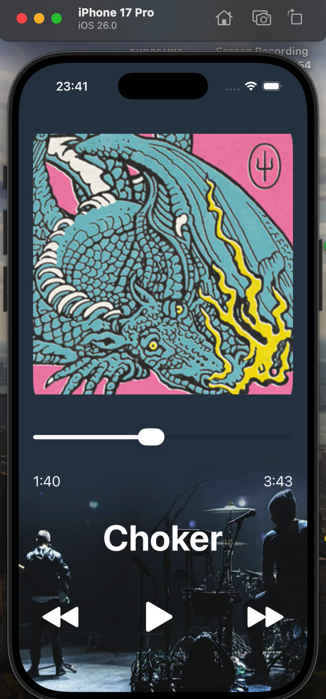
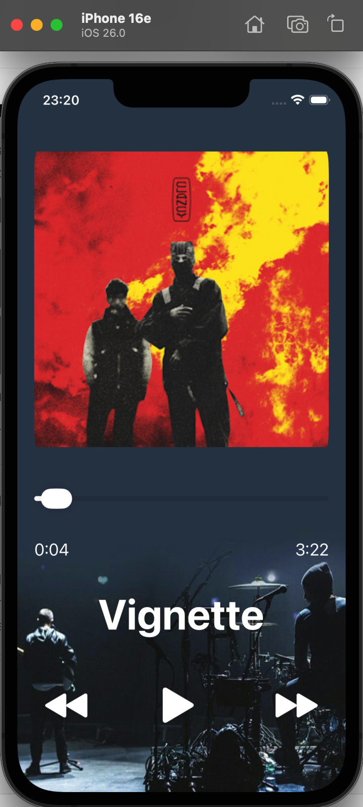

# Music Player App

## Description
This project is a simple **music player app** built in **Swift** using **UIKit** and **AVFoundation**.  
It lets users play, pause, skip tracks, and view the album cover with playback progress.  
The app also supports **looping** through songs and **seeking** to any position in a track using a slider.

---

## Features Implemented
- Play, pause, next, and previous track buttons  
- Display of song title, cover image, current time, and total duration  
- Real-time progress updates with `Timer`  
- Looping through the playlist  
- Seek functionality using `UISlider`  
- Smooth UI updates and playback control  

---

## Bonus Tasks Completed

### Bonus 1: Progress Bar ⭐
Added a `UISlider` or `UIProgressView` to show playback progress
- Update progress as the track "plays"
- Allow seeking through the track (if using UISlider)

### Bonus 2: Track Duration Display ⭐
Added `UILabel`s to show:
- Current playback time
- Total track duration
- Format: "MM:SS" style (e.g., "2:34")

---

## Third-Party Resources
- **Music files:** Converted from Apple Music (`.mp3` format, for educational/demo use)  
- **Icons:** Apple SF Symbols (`play.fill`, `pause.fill`, `forward.fill`, `backward.fill`)  
- **Images:** Album covers used for non-commercial demonstration  

---

## Screenshots

  
  
  

---

## Screen Recording

  

