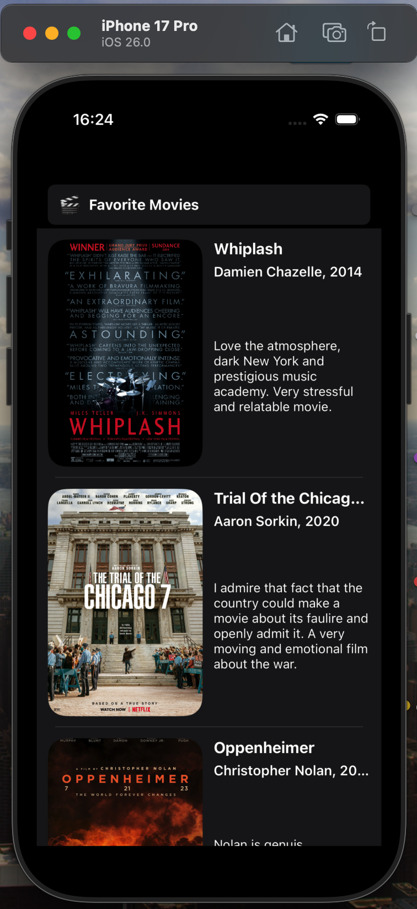
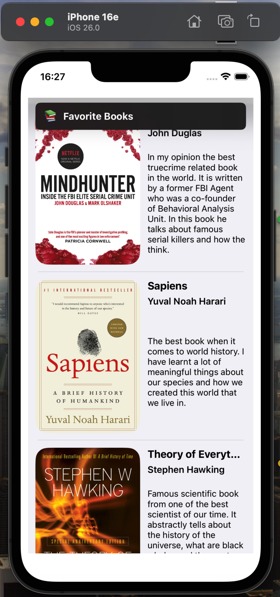

# Favorites TableView App

## Description
This project is a **Favorites List app** built in **Swift** using **UIKit** and **UITableView**.  
It displays a structured list of your favorite **movies, music albums, books, and courses**, each with an image, title, subtitle, and a short review.  
The app uses a custom table view cell, dynamic cell heights, adaptive layout, and supports **Light/Dark mode** automatically.

---

## Features Implemented
- Custom `UITableViewCell` with image, title, subtitle, and multiline review  
- Multiple table view sections (Movies, Music, Books, Courses)  
- Custom section headers created programmatically  
- Automatic dynamic cell resizing using Auto Layout  
- Adaptive UI that supports both **Light Mode** and **Dark Mode**  
- Data organized with model structs (`FavoriteItem`, `FavoriteSection`)  
- Smooth scrolling and clean UIKit layout  

---

## Bonus Tasks Completed

### Bonus: Custom Section Header View
A fully custom header view was added for each section:
- Displays emoji + section title  
- Created programmatically (`SectionHeaderView.swift`)  
- Uses Auto Layout and system colors for dark mode compatibility

---

## Third-Party Resources
- **Images:** App icons, posters, and course icons stored in the app bundle (used for educational/demo purposes)  
- **UI Components:** Pure UIKit (no external libraries)  
- **Colors & Layout:** System colors for Dark/Light mode support  

---

## Screenshots

  
  
  

